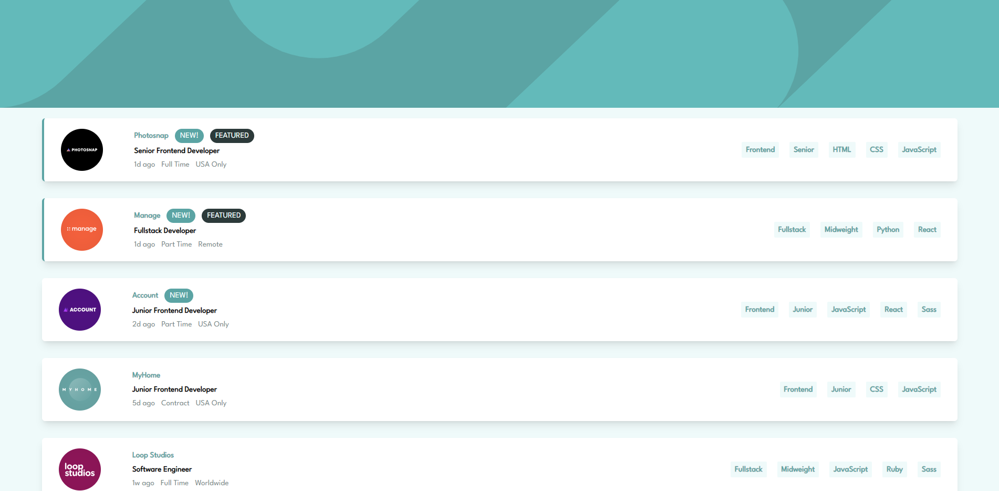

# Manuel Navarro - Job listings with filtering

Esta es una solución al [desafío de listados de trabajos con filtrado de Frontend Mentor](https://www.frontendmentor.io/challenges/qr-code-component-iux_sIO_H).

## Vista Previa

## Stack Tecnológico

- Vue.js
- Tailwind CSS

## Autor

- Website - [manuelnavarrodev.es](https://manuelnavarrodev.es/)
- Linkedln - [Manuel Navarro Higueras](https://www.linkedin.com/in/manuel-navarro-higueras/)
- Twitter - [@ManuNH98](https://www.twitter.com/ManuNH98)
